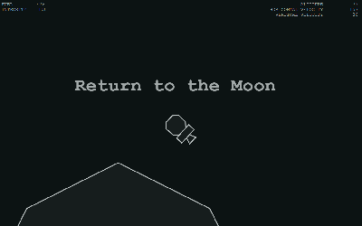

# Return to the Moon
A lunar-lander-inspired game for js13k

## JS13k?

* [JS13k Rules](http://2019.js13kgames.com/#rules): Make a game with a package size less than 13k (13,312 bytes)
* See all the entries for the competition at http://2019.js13kgames.com/

## Version 1.1

An improved, post-competition version featuring... 

* visible exhaust particles!
* zooming with keys or mouse wheel
* refactoring, reorganization of the code
* still less than 13k zipped

**[Play the latest version](https://deathraygames.github.io/lunar-lander-13k/src/)**

## Version 1.0 Submission for js13k 2019

Made for js13k competition 2019 over the course of just a few evenings. [Rated 106 out of 245 entries](http://js13kgames.com/#winners).

[Play the Original Version v1.0 (13k) on deathraygames.com](https://deathraygames.com/play-online/lunar-lander-13k/js13k/)

### Size

* Source: 17.3 KB (17,790 bytes)
  - scripts 14.9 KB
  - styles <1 KB (692 bytes)
  - index.html 1.73 KB
* _didn't minify_
* Zipped: **7.35 KB** (7,529 bytes)

## Credits

 * Developed by Luke Nickerson
